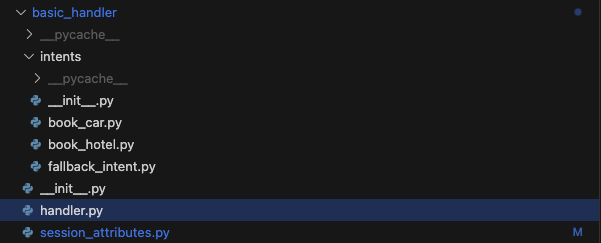

<h2 align="center">Lex Helper Library</h2>

<p align="center">
<a href="LICENSE"></a>
<a href="https://github.com/psf/black"></a>
</p>

> "This is the best thing since sliced bread" - Lex

The Lex Helper library is an extensive collection of functions and classes that make it easier to work with Lex. It's designed to make building Lex fulfillment lambdas easier, more efficient, understandable, and consistent. Gone are the days of accidentally mistyping a slot name, using a dictionary within a dictionary within a dictionary, or not being able to find where the code for a specific intent is.

## Why Use Lex Helper?

- **Simplified Intent Management**: Each intent's logic lives in its own file under an `intents/` directory, making it easy to locate, maintain, and scale your bot's capabilities without navigating complex nested handlers. The library will dynamically load the intent handler based on the intent name.



- **Type-Safe Session Attributes**: Define your session attributes as a Pydantic model, eliminating runtime errors from typos or incorrect data types. Get full IDE autocomplete support and catch errors before they reach production.


- **Automatic Request/Response Handling**: Stop wrestling with deeply nested dictionaries. The library handles all the Lex request/response formatting, letting you focus on your bot's business logic.

- **Channel-Aware Formatting**: Built-in support for different channels (SMS, Lex console, etc.) ensures your responses are properly formatted regardless of how users interact with your bot.

- **Error Handling Made Easy**: Comprehensive exception handling and error reporting help you quickly identify and fix issues in your fulfillment logic.

- **Reduced Boilerplate**: Common Lex operations like transitioning between intents, handling dialog states, and managing session attributes are simplified into clean, intuitive methods.

- **Developer Experience**: Get the benefits of modern Python features like type hints, making your code more maintainable and easier to understand. Full IDE support means better autocomplete and fewer runtime errors.

## Installation

```bash
pip install lex-helper
```

For Lambda deployment, see [Lambda Layer Deployment Guide](docs/LAMBDA_LAYER_DEPLOYMENT.md).

## Quick Start

### 1. Create Session Attributes

```python
from pydantic import ConfigDict, Field
from lex_helper import SessionAttributes

class CustomSessionAttributes(SessionAttributes):
    model_config = ConfigDict(extra="allow")
    user_name: str = Field(default="", description="User's name")
    visit_count: int = Field(default=0, description="Number of visits")
```

### 2. Create Main Handler

```python
from typing import Any
from lex_helper import Config, LexHelper
from .session_attributes import CustomSessionAttributes

def lambda_handler(event: dict[str, Any], context: Any) -> dict[str, Any]:
    config = Config(
        session_attributes=CustomSessionAttributes(), 
        package_name="your_project.intents"
    )
    lex_helper = LexHelper(config=config)
    return lex_helper.handler(event, context)
```

### 3. Create Intent Handlers

Structure your intents in an `intents/` directory:

```
your_project/
├── intents/
│   ├── __init__.py
│   ├── welcome_intent.py
│   └── booking_intent.py
├── session_attributes.py
└── handler.py
```

## Core Features

### Dialog Utilities
- **get_intent**, **get_slot**, **set_slot**: Manage intent and slot data
- **elicit_intent**, **elicit_slot**, **delegate**: Control dialog flow
- **close**: Complete dialog interactions
- **transition_to_intent**: Navigate between intents
- **any_unknown_slot_choices**, **handle_any_unknown_slot_choice**: Handle invalid inputs
- **get_active_contexts**, **remove_context**: Manage conversation context
- **load_messages**: Parse message data

### Message Management
- **MessageManager**: Centralized message management with locale support
- **get_message**, **set_locale**: Load and retrieve localized messages from YAML files
- Supports `messages_{localeId}.yaml` files (e.g., `messages_en_US.yaml`, `messages_es_ES.yaml`)
- Automatic fallback to `messages.yaml` for missing locales

### Bedrock Integration
- **invoke_bedrock**: Direct integration with Amazon Bedrock models
- Supports multiple model families (Claude, Titan, Jurassic, Cohere, Llama)
- Automatic fallback between on-demand and inference profile modes
- **Converse API**: Unified interface for model interactions with system prompt support
- **InvokeModel API**: Traditional model invocation (default behavior)

## Documentation

**Recommended Reading Order:**
1. **[Best Practices Guide](docs/BEST_PRACTICES.md)**: Start here for detailed usage patterns, advanced examples, and code organization
2. **[Testing Guide](docs/TESTING_GUIDE.md)**: Then learn comprehensive testing strategies for your Lex bots
3. **[Lambda Layer Deployment](docs/LAMBDA_LAYER_DEPLOYMENT.md)**: Finally, deploy as Lambda layers for better performance

## Bedrock Usage Examples

### Basic InvokeModel API
```python
from lex_helper import invoke_bedrock

response = invoke_bedrock(
    prompt="What are the airports in Los Angeles?",
    model_id="anthropic.claude-3-sonnet-20240229-v1:0",
    max_tokens=200,
    temperature=0.1
)
print(response['text'])
```

### Converse API with System Prompt
```python
response = invoke_bedrock(
    prompt="What are the airports in Los Angeles?",
    model_id="anthropic.claude-3-5-sonnet-20240620-v1:0",
    max_tokens=200,
    temperature=0.1,
    use_converse=True,
    system_prompt="You are a travel expert. Provide accurate airport information."
)
print(response['text'])
```

## Examples

- **Basic Example**: See `examples/basic_handler/` for a simple implementation
- **Comprehensive Example**: Check out the [Airline-Bot](https://gitlab.aws.dev/lex/Airline-Bot) for production-ready patterns including:
  - Advanced intent organization and management
  - Complex session attribute handling
  - Multi-turn conversation flows
  - Error handling and fallback strategies
  - Best practices for bot architecture
  - Production deployment patterns