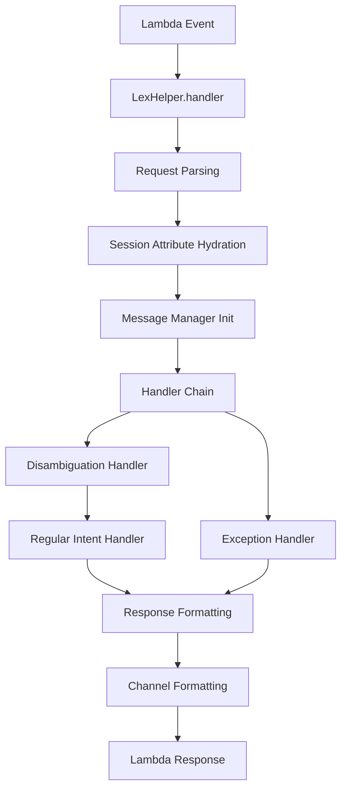

# Architecture

This guide provides a deep technical dive into lex-helper's internal architecture, design principles, and implementation details. Understanding these concepts will help you build more effective chatbots and extend the library for your specific needs.

## Overview

lex-helper is built around a layered architecture that prioritizes type safety, testability, and extensibility. The library transforms raw Amazon Lex events into strongly-typed Python objects, routes them through a handler system, and formats responses for different channels.



## Core Architecture

### Request Processing Pipeline

The request processing pipeline transforms raw Lex events into structured responses through several stages:

#### 1. Event Parsing and Validation
```python
def parse_lex_request(event: dict[str, Any], session_attributes: T) -> LexRequest[T]:
    """Parse raw Lambda event into strongly-typed LexRequest."""
    # Validates event structure using Pydantic
    # Hydrates session attributes with custom types
    # Extracts interpretations and confidence scores
```

The parsing stage uses Pydantic models to ensure type safety and validate incoming data structure. This catches malformed requests early and provides clear error messages.

#### 2. Session Attribute Management
```python
class SessionState[T: SessionAttributes](BaseModel):
    activeContexts: ActiveContexts = None
    sessionAttributes: T = cast(T, None)
    intent: Intent
    dialogAction: DialogAction | None = None
```

Session attributes are strongly typed using Python generics, allowing you to define custom session state while maintaining type safety throughout the request lifecycle.

#### 3. Handler Resolution and Execution
The library uses a chain-of-responsibility pattern for handler execution:

```python
handlers: list[Callable[[LexRequest[T]], LexResponse[T] | None]] = []

# Add disambiguation handler first if enabled
if self.disambiguation_handler:
    handlers.append(self.disambiguation_intent_handler)

# Add regular intent handler
handlers.append(self.regular_intent_handler)
```

### Handler Resolution System

The handler resolution system dynamically loads intent handlers based on naming conventions:

#### File-Based Handler Discovery
```python
def call_handler_for_file(
    intent_name: str, 
    lex_request: LexRequest[T], 
    package_name: str | None
) -> LexResponse[T]:
    """Dynamically import and call handler for intent."""
    # Converts intent name to module path
    # Imports handler module dynamically
    # Calls handler function with request
```

#### Handler Naming Convention
- Intent: `BookHotel` → Handler: `intents/book_hotel.py`
- Function: `handler(lex_request: LexRequest[T]) -> LexResponse[T]`

This convention-over-configuration approach reduces boilerplate while maintaining flexibility.

### Type System Architecture

lex-helper implements comprehensive type safety using Python's type system:

#### Generic Session Attributes
```python
T = TypeVar("T", bound=SessionAttributes)

class LexHelper[T: SessionAttributes]:
    def __init__(self, config: Config[T]):
        self.config = config
```

This allows custom session attributes while preserving type information throughout the request lifecycle.

#### Discriminated Unions for Messages
```python
LexBaseResponse = Annotated[
    LexPlainText | LexImageResponseCard | LexCustomPayload,
    Field(discriminator="contentType"),
]
```

Message types use discriminated unions to ensure type safety while supporting multiple message formats.

### Extension Points

The architecture provides several extension points for customization:

#### 1. Custom Session Attributes
```python
class CustomSessionAttributes(SessionAttributes):
    user_id: str | None = None
    preferences: dict[str, Any] = {}
    authentication_token: str | None = None
```

#### 2. Handler Middleware
```python
def middleware_handler(lex_request: LexRequest[T]) -> LexResponse[T] | None:
    # Pre-processing logic
    response = next_handler(lex_request)
    # Post-processing logic
    return response
```

#### 3. Channel Extensions
```python
class CustomChannel(Channel):
    def format_message(self, message: LexMessages) -> LexBaseResponse:
        # Custom formatting logic
        pass
```

## Design Principles

### Type Safety First

Every component in lex-helper is designed with type safety as a primary concern:

- **Pydantic Models**: All data structures use Pydantic for validation and serialization
- **Generic Types**: Session attributes maintain type information across the request lifecycle
- **Discriminated Unions**: Message types are validated at runtime using discriminated unions
- **Type Guards**: Runtime type checking where static analysis isn't sufficient

### Channel Abstraction

The channel abstraction layer allows the same handler logic to work across different communication channels:

```python
class Channel(ABC):
    @abstractmethod
    def format_message(self, message: LexMessages) -> LexBaseResponse:
        """Format message for specific channel."""
        pass
```

This separation of concerns allows you to:
- Write channel-agnostic handler logic
- Add new channels without modifying existing handlers
- Test handlers independently of channel formatting

### Testability

The architecture prioritizes testability through:

- **Dependency Injection**: Configuration and dependencies are injected rather than hardcoded
- **Pure Functions**: Most functions are pure, making them easy to test
- **Mocking Points**: Clear interfaces for mocking external dependencies
- **Type Safety**: Strong typing catches errors at development time

### Performance Optimization

Design choices optimized for AWS Lambda environments:

- **Lazy Loading**: Components are loaded only when needed
- **Singleton Patterns**: Expensive resources are reused across invocations
- **Minimal Dependencies**: Core functionality has minimal external dependencies
- **Efficient Serialization**: Pydantic provides fast serialization/deserialization

## Internal Components

### Core Handler System

The handler system is built around the `LexHelper` class:

```python
class LexHelper[T: SessionAttributes]:
    def __init__(self, config: Config[T]):
        self.config = config
        self._initialize_components()
    
    def handler(self, event: dict[str, Any], context: Any) -> dict[str, Any]:
        """Main entry point for Lambda requests."""
        return self._process_request(event, context)
```

#### Configuration System
```python
class Config[T: SessionAttributes](BaseModel):
    session_attributes: T
    package_name: str | None = "fulfillment_function"
    auto_initialize_messages: bool = True
    auto_handle_exceptions: bool = True
    error_message: str | None = None
    enable_disambiguation: bool = False
    disambiguation_config: Any | None = None
```

The configuration system uses Pydantic for validation and provides sensible defaults while allowing customization.

### Session Management

Session management handles state persistence across conversation turns:

#### Session Attribute Lifecycle
1. **Hydration**: Raw session data is converted to typed objects
2. **Processing**: Handlers can read and modify session state
3. **Serialization**: Session state is converted back to Lex format
4. **Persistence**: Lex manages session persistence automatically

#### State Management Patterns
```python
# Reading session state
user_id = lex_request.sessionState.sessionAttributes.user_id

# Modifying session state
lex_request.sessionState.sessionAttributes.last_intent = intent_name

# Conditional state updates
if not lex_request.sessionState.sessionAttributes.user_authenticated:
    return redirect_to_authentication(lex_request)
```

### Error Propagation

Error handling follows a structured approach:

#### Exception Hierarchy
```python
class LexHelperException(Exception):
    """Base exception for lex-helper."""
    pass

class IntentNotFoundError(LexHelperException):
    """Raised when intent handler cannot be found."""
    pass

class BedrockInvocationError(LexHelperException):
    """Raised when Bedrock API calls fail."""
    pass
```

#### Error Handler Chain
```python
def handle_exceptions(
    exception: Exception, 
    lex_request: LexRequest[T], 
    error_message: str | None = None
) -> LexResponse[T]:
    """Convert exceptions to user-friendly responses."""
    # Log exception details
    # Generate appropriate user message
    # Return structured error response
```

### Disambiguation System

The smart disambiguation system analyzes user input confidence scores:

#### Analysis Pipeline
```python
# Example implementation structure
class DisambiguationAnalyzer:
    def analyze_request(self, lex_request: LexRequest) -> DisambiguationResult:
        # Extract confidence scores from interpretations
        # Apply threshold analysis
        # Generate candidate list
        # Return disambiguation decision
        pass  # Implementation details
```

#### Handler Integration
```python
# Example handler structure
def disambiguation_intent_handler(self, lex_request: LexRequest[T]) -> LexResponse[T] | None:
    # Check for disambiguation response
    # Analyze confidence scores
    # Generate clarification if needed
    # Route to selected intent
    pass  # Implementation details
```

### Message Management

The message management system provides internationalization support:

#### Locale-Aware Loading
```python
# Example message manager structure
class MessageManager:
    def _load_messages(cls, locale: str | None = None) -> None:
        # Search for locale-specific files
        # Fall back to default messages
        # Cache loaded messages
        # Handle loading errors gracefully
        pass  # Implementation details
```

#### Message Resolution
```python
# Example message resolution function
def get_message(key: str, default: str | None = None, locale: str | None = None) -> str:
    # Support nested keys with dot notation
    # Handle locale fallbacks
    # Provide default values
    # Log missing keys for debugging
    pass  # Implementation details
```

### Logging and Observability

Built-in logging follows Python logging best practices:

#### Logger Configuration
```python
# Add NullHandler to prevent unwanted output
logging.getLogger(__name__).addHandler(logging.NullHandler())
```

#### Structured Logging
```python
logger.debug(
    "Processing request - sessionId: %s, utterance: %s, sessionAttributes: %s",
    lex_payload.sessionId,
    lex_payload.inputTranscript,
    lex_payload.sessionState.sessionAttributes.model_dump(exclude_none=True),
)
```

## Advanced Patterns

### Callback Pattern

The callback pattern allows complex conversation flows:

```python
# Store current state and transition to new intent
lex_request.sessionState.sessionAttributes.callback_handler = current_intent
lex_request.sessionState.sessionAttributes.callback_event = json.dumps(lex_request)

# Later, return to original intent
return dialog.callback_original_intent_handler(lex_request)
```

### Context Management

Active contexts provide conversation state management:

```python
# Add context for conversation flow
lex_request.sessionState.activeContexts = [{
    "name": "booking_flow",
    "contextAttributes": {},
    "timeToLive": {"timeToLiveInSeconds": 900, "turnsToLive": 20}
}]

# Check for active context
if dialog.get_active_contexts(lex_request):
    # Handle context-specific logic
    pass
```

### Slot Management

Advanced slot handling patterns:

```python
# Composite slot handling
booking_details = dialog.get_composite_slot("BookingDetails", intent)
if booking_details:
    check_in_date = booking_details.get("CheckInDate")
    check_out_date = booking_details.get("CheckOutDate")

# Dynamic slot elicitation
if not dialog.get_slot("RequiredSlot", intent):
    return dialog.elicit_slot("RequiredSlot", messages, lex_request)
```

## Performance Considerations

### Memory Management

- **Object Reuse**: Reuse expensive objects across invocations
- **Lazy Loading**: Load components only when needed
- **Memory Profiling**: Monitor memory usage in production

### Cold Start Optimization

- **Import Optimization**: Import heavy dependencies conditionally
- **Initialization Caching**: Cache expensive initialization operations
- **Dependency Management**: Minimize dependency tree size

### Response Time Optimization

- **Async Operations**: Use async/await for I/O operations where possible
- **Connection Pooling**: Reuse database and API connections
- **Caching Strategies**: Cache frequently accessed data

---

*This page is part of the comprehensive lex-helper documentation. [Performance →](performance.md)*