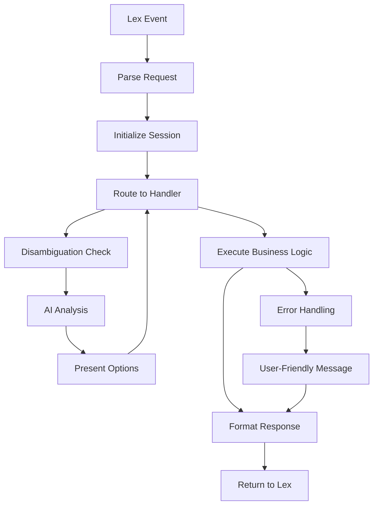

# Core Concepts

Understanding the core concepts of lex-helper will help you build robust, maintainable chatbots. This guide covers the fundamental architecture, design principles, and key components that make lex-helper powerful and easy to use.

## Overview

lex-helper is built around several key concepts that work together to provide a seamless development experience:

- **Type-safe session management** with Pydantic models
- **Channel-aware formatting** for different communication interfaces
- **Intent-based architecture** with automatic handler discovery
- **Graceful error handling** with automatic recovery
- **Smart disambiguation** using AI when needed

## Design Principles

### 1. Type Safety First

lex-helper prioritizes type safety throughout the entire request lifecycle. Every component uses comprehensive type hints and Pydantic models for runtime validation:

```python
# Type-safe session attributes
class BookingSessionAttributes(SessionAttributes):
    departure_city: str = ""
    arrival_city: str = ""
    travel_date: str = ""
    passenger_count: int = 1

# Type-safe request handling
def handler(lex_request: LexRequest[BookingSessionAttributes]) -> LexResponse[BookingSessionAttributes]:
    # Full IDE support and runtime validation
    session_attrs = lex_request.sessionState.sessionAttributes
    if session_attrs.passenger_count > 10:
        # Type checking catches errors at development time
        return handle_large_group_booking(lex_request)
```

### 2. Channel Abstraction

Write once, run everywhere. lex-helper abstracts away channel-specific formatting so your business logic works across SMS, web, and voice interfaces:

```python
# Single response definition
response = LexResponse(
    messages=[
        LexPlainText(content="Choose your preferred flight:"),
        LexImageResponseCard(
            title="Available Flights",
            buttons=[
                {"text": "Morning (8 AM)", "value": "morning"},
                {"text": "Evening (6 PM)", "value": "evening"}
            ]
        )
    ]
)

# Automatically formatted for each channel:
# SMS: "Choose your preferred flight: 1) Morning (8 AM) 2) Evening (6 PM)"
# Web: Rich card with clickable buttons
# Voice: "Choose your preferred flight: morning 8 AM or evening 6 PM"
```

### 3. Convention Over Configuration

lex-helper uses sensible defaults and naming conventions to minimize boilerplate:

```python
# File: intents/book_flight.py
def handler(lex_request, session_attributes):
    # Automatically handles BookFlight intent
    pass

# File: intents/cancel_booking.py  
def handler(lex_request, session_attributes):
    # Automatically handles CancelBooking intent
    pass
```

### 4. Graceful Error Handling

Errors are handled gracefully with user-friendly messages while preserving session state:

```python
config = Config(
    session_attributes=MySessionAttributes(),
    auto_handle_exceptions=True,
    error_message="I'm sorry, something went wrong. Let me help you with that."
)
```

## Core Architecture

### The LexHelper Class

The [`LexHelper`](../api/core.md#lex_helper.core.handler.LexHelper) class is the main entry point for your chatbot. It orchestrates the entire request lifecycle:

```python
from lex_helper import LexHelper, Config, SessionAttributes

class MySessionAttributes(SessionAttributes):
    user_name: str = ""
    conversation_state: str = "greeting"

config = Config(session_attributes=MySessionAttributes())
lex_helper = LexHelper(config)

def lambda_handler(event, context):
    return lex_helper.handler(event, context)
```

The handler automatically:
- Parses incoming Lex requests using [`parse_lex_request`](../api/core.md#lex_helper.core.dialog.parse_lex_request)
- Routes to appropriate intent handlers
- Manages session state with type safety
- Formats responses for the correct channel
- Handles errors gracefully

### Request Lifecycle

1. **Request Parsing**: Incoming events are parsed into [`LexRequest`](../api/core.md#type-definitions) objects
2. **Intent Resolution**: The intent name is extracted and mapped to a handler function
3. **Handler Execution**: Your intent handler is called with typed session attributes
4. **Response Formatting**: The response is formatted using [`format_for_channel`](../api/channels.md#channel-formatting)
5. **Error Handling**: Any exceptions are caught and converted to user-friendly responses

## Type Safety

### Session Attributes

Session attributes in lex-helper are type-safe using Pydantic models. This provides several benefits:

```python
from lex_helper.core.types import SessionAttributes

class BookingSessionAttributes(SessionAttributes):
    departure_city: str = ""
    arrival_city: str = ""
    travel_date: str = ""
    passenger_count: int = 1
    booking_confirmed: bool = False
```

**Benefits:**
- **IDE Support**: Full autocomplete and type checking
- **Runtime Validation**: Automatic validation of data types
- **Documentation**: Self-documenting code with clear data structures
- **Refactoring Safety**: Changes are caught at development time

### Type Hints Throughout

All lex-helper functions use comprehensive type hints:

```python
def create_response(
    message: str,
    session_attributes: SessionAttributes,
    intent_name: str = "FallbackIntent"
) -> LexResponse:
    # Implementation with full type safety
```

## Channel Abstraction

### Multi-Channel Support

lex-helper automatically handles different communication channels:

- **SMS**: Text-only with length constraints
- **Web/Lex**: Rich formatting with buttons and cards  
- **Voice**: Speech-optimized responses

The [`format_for_channel`](../api/channels.md#channel-formatting) function automatically adapts your responses:

```python
# Your handler returns a rich response
response = LexResponse(
    messages=[
        LexPlainText(content="Choose an option:"),
        LexImageResponseCard(
            title="Flight Options",
            buttons=[
                {"text": "Morning Flight", "value": "morning"},
                {"text": "Evening Flight", "value": "evening"}
            ]
        )
    ]
)

# Automatically formatted for each channel:
# SMS: "Choose an option: 1) Morning Flight 2) Evening Flight"
# Web: Full rich card with clickable buttons
# Voice: "Choose an option: morning flight or evening flight"
```

### Channel Detection

The library automatically detects the channel from the Lex request and applies appropriate formatting. You can also explicitly specify channels when needed.

## Intent Handling

### Automatic Handler Discovery

lex-helper automatically discovers and routes to your intent handlers based on naming conventions:

```python
# File: intents/book_flight.py
def book_flight_handler(lex_request, session_attributes):
    # Handle BookFlight intent
    return response

# File: intents/cancel_booking.py  
def cancel_booking_handler(lex_request, session_attributes):
    # Handle CancelBooking intent
    return response
```

The library handles the routing automatically using internal utilities.

### Handler Patterns

Common handler patterns include:

- **Slot Collection**: Gathering required information from users
- **Validation**: Checking user input and providing feedback
- **Integration**: Calling external APIs and services
- **State Management**: Tracking conversation progress

## Error Handling

### Automatic Exception Handling

When enabled, lex-helper automatically catches and handles exceptions:

```python
config = Config(
    session_attributes=MySessionAttributes(),
    auto_handle_exceptions=True,
    error_message="I'm sorry, something went wrong. Please try again."
)
```

The [`handle_exceptions`](../api/exceptions.md#lex_helper.exceptions.handlers.handle_exceptions) function converts exceptions into user-friendly responses while preserving session state.

### Custom Error Messages

You can provide custom error messages or use message keys for internationalization:

```python
# Direct message
error_message = "We're experiencing technical difficulties."

# Message key (requires MessageManager)
error_message = "error.technical_difficulty"
```

## Smart Disambiguation

### AI-Powered Intent Resolution

When users provide ambiguous input, lex-helper can use AI to determine the most likely intent:

```python
from lex_helper.core.disambiguation.types import DisambiguationConfig

config = Config(
    session_attributes=MySessionAttributes(),
    enable_disambiguation=True,
    disambiguation_config=DisambiguationConfig(
        model_id="anthropic.claude-3-haiku-20240307-v1:0",
        confidence_threshold=0.8
    )
)
```

The [`DisambiguationHandler`](../api/core.md#lex_helper.core.disambiguation.handler.DisambiguationHandler) analyzes user input and suggests the most appropriate intent.

## Architectural Components

### Request Processing Pipeline

lex-helper processes requests through a well-defined pipeline:



### Core Components

#### 1. LexHelper Class

The central orchestrator that manages the entire request lifecycle:

```python
class LexHelper[T: SessionAttributes]:
    def __init__(self, config: Config[T]):
        self.config = config
        # Initialize disambiguation if enabled
        # Set up error handling
        # Configure message management
    
    def handler(self, event: dict, context: Any) -> dict:
        # Main entry point for Lambda
        # Handles parsing, routing, and response formatting
```

#### 2. Configuration System

Type-safe configuration with sensible defaults:

```python
class Config[T: SessionAttributes]:
    session_attributes: T                    # Your custom session attributes
    package_name: str | None = None         # Package for intent discovery
    auto_initialize_messages: bool = True    # Auto-setup MessageManager
    auto_handle_exceptions: bool = True      # Automatic error handling
    error_message: str | None = None        # Custom error message
    enable_disambiguation: bool = False      # AI-powered disambiguation
    disambiguation_config: Any | None = None # Disambiguation settings
```

#### 3. Dialog Management

Comprehensive utilities for conversation flow:

```python
# Core dialog actions
dialog.close(messages, lex_request)           # End conversation
dialog.elicit_slot(slot, messages, lex_request)  # Ask for specific info
dialog.elicit_intent(messages, lex_request)   # Open-ended question
dialog.delegate(lex_request)                  # Let Lex handle next step

# Advanced utilities
dialog.get_slot(slot_name, intent)           # Extract slot values
dialog.set_slot(slot_name, value, intent)    # Set slot programmatically
dialog.any_unknown_slot_choices(lex_request) # Detect invalid responses
```

#### 4. Channel Abstraction Layer

Automatic formatting for different communication channels:

```python
# Single response definition
response = LexResponse(messages=[...])

# Automatically formatted for:
# - SMS: Text-only with numbered options
# - Web: Rich cards with buttons and images  
# - Voice: Speech-optimized with SSML
formatted = format_for_channel(response, channel="auto")
```

### Data Flow Architecture

#### Request Flow

1. **Event Reception**: Lambda receives Lex event
2. **Request Parsing**: Convert to typed `LexRequest` object
3. **Session Restoration**: Load and validate session attributes
4. **Intent Routing**: Map intent name to handler function
5. **Handler Execution**: Run business logic with type safety
6. **Response Building**: Create structured response
7. **Channel Formatting**: Adapt for target channel
8. **Response Return**: Send back to Lex

#### Session Management

```python
# Session attributes flow through the entire pipeline
LexRequest[MySessionAttributes] → Handler → LexResponse[MySessionAttributes]

# Type safety ensures consistency
def handler(
    lex_request: LexRequest[BookingSessionAttributes]
) -> LexResponse[BookingSessionAttributes]:
    # Full type checking and IDE support
    session_attrs = lex_request.sessionState.sessionAttributes
    session_attrs.booking_step = "payment"  # Type-safe assignment
```

### Integration Points

#### External Services

lex-helper integrates seamlessly with AWS services and external APIs:

```python
def handler(lex_request: LexRequest[MySessionAttributes]) -> LexResponse[MySessionAttributes]:
    # AWS service integration
    dynamodb = boto3.resource('dynamodb')
    table = dynamodb.Table('bookings')
    
    # External API calls
    response = requests.get('https://api.flights.com/search')
    
    # Error handling is automatic
    return process_results(response.json(), lex_request)
```

#### Message Management

Built-in internationalization and localization:

```python
from lex_helper import get_message, set_locale

# Automatic locale detection from Lex request
set_locale(lex_request.bot.localeId)  # "en_US", "es_ES", etc.

# Localized messages
welcome_message = get_message("welcome.greeting")
error_message = get_message("error.booking_failed")
```

## Best Practices

### 1. Use Type-Safe Session Attributes

Always define your session attributes with proper types:

```python
class MySessionAttributes(SessionAttributes):
    # Use specific types
    user_id: int
    preferences: dict[str, str] = {}
    
    # Provide defaults for optional fields
    last_activity: str = ""
    
    # Use enums for constrained values
    booking_status: BookingStatus = BookingStatus.PENDING
```

### 2. Handle All Intent States

Consider all possible states in your intent handlers:

```python
def book_flight_handler(lex_request, session_attributes):
    # Check prerequisites
    if not session_attributes.user_authenticated:
        return redirect_to_authentication(lex_request)
    
    # Progressive slot collection
    if not session_attributes.departure_city:
        return ask_for_departure()
    elif not session_attributes.arrival_city:
        return ask_for_arrival()
    else:
        return confirm_booking()
```

### 3. Use Channel-Appropriate Responses

Design responses that work well across all channels:

```python
# Good: Works on all channels
return "Your flight is booked! Confirmation: ABC123"

# Better: Rich for web, graceful fallback for SMS
return LexResponse(
    messages=[
        LexPlainText(content="Your flight is booked!"),
        LexImageResponseCard(
            title="Booking Confirmation",
            subtitle="Flight ABC123",
            buttons=[{"text": "View Details", "value": "view_booking"}]
        )
    ]
)
```

### 4. Enable Error Handling

Always enable automatic error handling in production:

```python
config = Config(
    session_attributes=MySessionAttributes(),
    auto_handle_exceptions=True,
    error_message="I apologize for the inconvenience. Please try again."
)
```

### 5. Leverage Smart Disambiguation

Use AI-powered disambiguation for better user experience:

```python
from lex_helper.core.disambiguation.types import DisambiguationConfig

config = Config(
    session_attributes=MySessionAttributes(),
    enable_disambiguation=True,
    disambiguation_config=DisambiguationConfig(
        model_id="anthropic.claude-3-haiku-20240307-v1:0",
        confidence_threshold=0.8
    )
)
```

## Related Topics

- **[API Reference](../api/index.md)** - Complete API documentation
- **[Session Attributes](session-attributes.md)** - Deep dive into type-safe session management
- **[Intent Handling](intent-handling.md)** - Organizing and implementing intent handlers
- **[Channel Formatting](channel-formatting.md)** - Multi-channel response formatting
- **[Error Handling](error-handling.md)** - Robust error handling strategies
- **[Smart Disambiguation](smart-disambiguation.md)** - AI-powered intent resolution

---

**Next**: Learn about [Session Attributes](session-attributes.md) for type-safe state management.