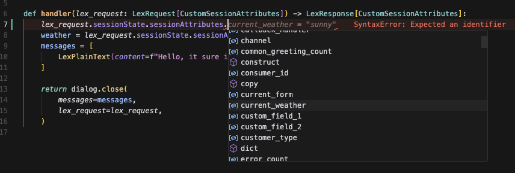
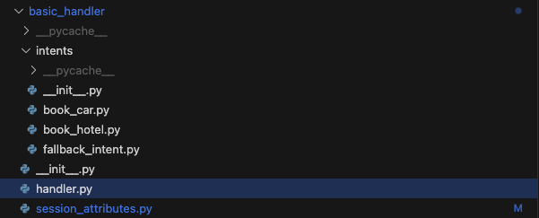

# Lex-Helper

<div class="hero-section" markdown>

<div class="hero-content" markdown>

## Build Amazon Lex chatbots with confidence

**A modern, type-safe Python library that eliminates the complexity of Lex development**

Stop wrestling with nested dictionaries and runtime errors. Lex-Helper provides a clean, intuitive API that makes building production-ready chatbots fast and reliable.

<div class="hero-buttons" markdown>
[Get Started :material-rocket-launch:](getting-started/quick-start.md){ .md-button .md-button--primary }
[View Examples :material-code-braces:](examples/index.md){ .md-button }
</div>

</div>

<div class="hero-code" markdown>
```python title="Your first chatbot in minutes"
from lex_helper import LexHelper, Config, SessionAttributes

class MySessionAttributes(SessionAttributes):
    user_name: str = ""
    visit_count: int = 0

def lambda_handler(event, context):
    config = Config(
        session_attributes=MySessionAttributes(),
        package_name="my_bot.intents"
    )
    lex_helper = LexHelper(config=config)
    return lex_helper.handler(event, context)
```
</div>

</div>

## Why developers choose Lex-Helper

<div class="features-grid" markdown>

<div class="feature-card" markdown>
### :material-shield-check: Type-Safe Development
Define session attributes as Pydantic models with full IDE support. Catch errors at development time, not in production.


</div>

<div class="feature-card" markdown>
### :material-folder-outline: Organized Intent Management
Each intent lives in its own file with automatic discovery. Scale your bot without losing track of your code.


</div>

<div class="feature-card" markdown>
### :material-brain: Smart Disambiguation
Automatically handle ambiguous user input with AI-powered clarification using Amazon Bedrock integration.

```python
# Enable smart disambiguation
config = Config(
    enable_disambiguation=True,
    disambiguation_config=DisambiguationConfig(
        confidence_threshold=0.5,
        bedrock_config=BedrockDisambiguationConfig(
            enabled=True,
            model_id="anthropic.claude-3-haiku-20240307-v1:0"
        )
    )
)
```
</div>

<div class="feature-card" markdown>
### :material-devices: Multi-Channel Support
Built-in formatting for SMS, web, and voice channels. One codebase, multiple interfaces.

```python
from lex_helper import format_for_channel

# Automatically formats for the user's channel
response = format_for_channel(
    message="Welcome! How can I help?",
    buttons=[Button("Book Flight"), Button("Check Status")],
    channel=request.channel
)
```
</div>

<div class="feature-card" markdown>
### :material-translate: Internationalization
Seamless multi-language support with automatic locale detection and fallbacks.

```python
# messages_en_US.yaml, messages_es_ES.yaml
from lex_helper import get_message

welcome_msg = get_message("welcome", locale="es_ES")
# Automatically falls back to default if locale not found
```
</div>

<div class="feature-card" markdown>
### :material-aws: AWS Native
Built specifically for AWS Lambda and Lex with optimized performance and native integrations.

- Lambda Layer deployment support
- Bedrock AI integration
- CloudWatch logging integration
- AWS SDK best practices
</div>

</div>


## Quick start paths

<div class="quick-start-grid" markdown>

<div class="path-card" markdown>
### :material-flash: 5-Minute Quick Start
Get a working chatbot running in minutes with our streamlined tutorial.

[Start Building →](getting-started/quick-start.md)
</div>

<div class="path-card" markdown>
### :material-school: Complete Tutorial
Learn step-by-step with our comprehensive first chatbot guide.

[Learn the Basics →](getting-started/first-chatbot.md)
</div>

<div class="path-card" markdown>
### :material-airplane: Real-World Example
Explore our production-ready airline booking bot implementation.

[See Advanced Patterns →](tutorials/airline-bot.md)
</div>

<div class="path-card" markdown>
### :material-api: API Reference
Dive deep into the complete API documentation with examples.

[Browse API Docs →](api/index.md)
</div>

</div>

## What's included

<div class="included-features" markdown>

**Core Features**
- Type-safe session attributes with Pydantic
- Automatic intent handler discovery and routing
- Comprehensive dialog state management
- Multi-channel response formatting
- Built-in error handling and logging

**Advanced Capabilities**
- Smart disambiguation with AI-powered responses
- Amazon Bedrock integration for enhanced AI features
- Message management with internationalization
- Production deployment patterns
- Comprehensive testing utilities

**Developer Experience**
- Full TypeScript-style type hints
- IDE autocomplete and error detection
- Extensive documentation and examples
- Active community support
- Regular updates and maintenance

</div>

---

<div class="get-started-footer" markdown>
Ready to build better chatbots? **[Get started in 5 minutes →](getting-started/quick-start.md)**

Questions? Check our **[FAQ](community/support.md)** or **[join the discussion](https://github.com/aws/lex-helper/discussions)**
</div>
