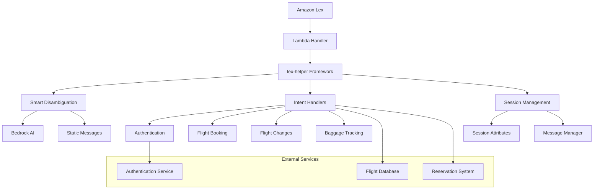

# Airline Bot Walkthrough

Explore the comprehensive sample airline bot to understand advanced lex-helper patterns, real-world implementation strategies, and production-ready features including smart disambiguation, Bedrock integration, and sophisticated error handling.

## What You'll Learn

This walkthrough covers advanced lex-helper concepts through a real-world airline customer service bot that handles:

- **Complex multi-slot conversations** with validation and recovery
- **Smart disambiguation** with AI-powered contextual responses
- **Authentication flows** with callback handling
- **Business logic integration** with external services
- **Comprehensive error handling** and user guidance
- **Multi-language support** with message management
- **Production deployment patterns** with monitoring and observability

**Estimated time:** 90-120 minutes

## Prerequisites

- Completed [basic chatbot tutorial](basic-chatbot.md)
- Understanding of [core concepts](../guides/core-concepts.md) and [smart disambiguation](../guides/smart-disambiguation.md)
- Familiarity with AWS services (Lambda, Lex, Bedrock)
- Experience with Python type hints and Pydantic models

## Architecture Overview

The airline bot demonstrates a sophisticated architecture that scales to handle real-world customer service scenarios.

### 🏗️ System Architecture



### 📁 Project Structure

```
sample_airline_bot/
├── lambdas/fulfillment_function/
│   ├── src/fulfillment_function/
│   │   ├── lambda_function.py          # Main handler with disambiguation
│   │   ├── session_attributes.py       # Airline-specific session state
│   │   ├── intents/                    # Intent handler modules
│   │   │   ├── authenticate.py         # User authentication flow
│   │   │   ├── book_flight.py          # Flight booking with validation
│   │   │   ├── change_flight.py        # Flight modification handling
│   │   │   ├── track_baggage.py        # Baggage tracking system
│   │   │   └── flight_delay_update.py  # Flight status updates
│   │   ├── messages/                   # Localized message files
│   │   │   ├── messages.yaml           # English messages
│   │   │   └── messages_es_ES.yaml     # Spanish messages
│   │   └── utils/                      # Shared utilities
│   │       ├── flight_data.py          # Flight data management
│   │       └── validation.py           # Input validation helpers
│   └── tests/                          # Comprehensive test suite
├── integration_tests/                  # End-to-end testing
└── lex-export/                        # Lex bot configuration
```

## Deep Dive: Main Handler with Smart Disambiguation

Let's examine the sophisticated main handler that demonstrates production-ready patterns.

### 🚀 Lambda Handler Analysis

The main handler showcases several advanced patterns:

```python
def lambda_handler(event: dict[str, Any], context: Any) -> dict[str, Any]:
    """
    Production-ready Lambda handler with smart disambiguation.
    
    Key features demonstrated:
    - Environment-based configuration
    - Bedrock AI integration with fallback
    - Custom intent grouping for disambiguation
    - Comprehensive logging and monitoring
    """
    
    # 1. Environment-based configuration
    enable_bedrock = os.getenv("ENABLE_BEDROCK_DISAMBIGUATION", "false").lower() == "true"
    
    # 2. Bedrock configuration with production settings
    bedrock_config = BedrockDisambiguationConfig(
        enabled=enable_bedrock,
        model_id=os.getenv("BEDROCK_MODEL_ID", "anthropic.claude-3-haiku-20240307-v1:0"),
        region_name=os.getenv("BEDROCK_REGION", "us-east-1"),
        max_tokens=int(os.getenv("BEDROCK_MAX_TOKENS", "150")),
        temperature=float(os.getenv("BEDROCK_TEMPERATURE", "0.3")),
        system_prompt=(
            "You are a helpful airline customer service assistant. "
            "Create clear, friendly disambiguation messages that help travelers "
            "choose between flight-related options. Be concise and professional."
        ),
        fallback_to_static=True,  # Graceful degradation
    )
    
    # 3. Smart disambiguation with custom intent groups
    disambiguation_config = DisambiguationConfig(
        confidence_threshold=0.4,
        max_candidates=2,
        similarity_threshold=0.15,
        # Group related intents for better disambiguation
        custom_intent_groups={
            "booking": ["BookFlight", "ChangeFlight", "CancelFlight"],
            "status": ["FlightDelayUpdate", "TrackBaggage"],
            "account": ["Authenticate"],
        },
        # Localized message keys for internationalization
        custom_messages={
            "disambiguation.two_options": "disambiguation.airline.two_options",
            "BookFlight_ChangeFlight": "disambiguation.airline.book_or_change",
            "FlightDelayUpdate_TrackBaggage": "disambiguation.airline.flight_or_baggage",
        },
        bedrock_config=bedrock_config,
    )
```

### 🎯 Key Patterns Demonstrated

1. **Environment-driven configuration** for different deployment stages
2. **Graceful AI fallback** when Bedrock is unavailable
3. **Custom intent grouping** for domain-specific disambiguation
4. **Message key localization** for multi-language support
5. **Comprehensive logging** for production monitoring

## Advanced Session Management

The airline bot uses sophisticated session attributes to maintain complex conversation state.

### 📊 Session Attributes Deep Dive

```python
class AirlineBotSessionAttributes(SessionAttributes):
    """
    Production-grade session attributes for airline operations.
    
    Demonstrates:
    - Logical grouping of related attributes
    - Comprehensive documentation
    - Type safety with Pydantic
    - Default values for reliability
    """
    
    # Flight booking workflow state
    origin_city: str = Field(default="", description="Departure city")
    destination_city: str = Field(default="", description="Arrival city")
    departure_date: str = Field(default="", description="Departure date")
    return_date: str = Field(default="", description="Return date (optional)")
    number_of_passengers: int = Field(default=1, description="Passenger count")
    trip_type: str = Field(default="one-way", description="Trip type")
    
    # Flight management operations
    reservation_number: str = Field(default="", description="Confirmation number")
    flight_number: str = Field(default="", description="Flight number")
    departure_airport: str = Field(default="", description="Airport code")
    
    # Authentication and security
    user_authenticated: bool = Field(default=False, description="Auth status")
    callback_handler: str = Field(default="", description="Post-auth callback")
    callback_event: str = Field(default="", description="Serialized request")
    
    # Error handling and recovery
    error_count: int = Field(default=0, description="Consecutive error count")
    
    # Internationalization
    user_locale: str = Field(default="en_US", description="User locale")
```

### 🔄 State Management Patterns

The bot demonstrates several state management patterns:

1. **Workflow state tracking** for multi-step processes
2. **Authentication state** with callback handling
3. **Error recovery state** for progressive assistance
4. **Localization state** for personalized experiences

## Complex Intent Handler: Flight Booking

Let's examine a sophisticated intent handler that demonstrates advanced patterns.

### ✈️ Flight Booking Handler Analysis

```python
def handler(lex_request: LexRequest[AirlineBotSessionAttributes]) -> LexResponse[AirlineBotSessionAttributes]:
    """
    Advanced flight booking handler demonstrating:
    - Progressive slot collection with validation
    - Business logic integration
    - Error handling and recovery
    - Dynamic response generation
    """
    
    intent = lex_request.sessionState.intent
    session_attrs = lex_request.sessionState.sessionAttributes
    
    # 1. Progressive slot collection with validation
    origin = get_slot_value("OriginCity", intent)
    destination = get_slot_value("DestinationCity", intent)
    departure_date = get_slot_value("DepartureDate", intent)
    
    # 2. Validate origin city with business logic
    if not origin:
        return dialog.elicit_slot(
            slot_to_elicit="OriginCity",
            messages=[get_localized_message("booking.ask_origin")],
            lex_request=lex_request,
        )
    
    # Validate against airport database
    if not is_valid_airport_city(origin):
        return dialog.elicit_slot(
            slot_to_elicit="OriginCity",
            messages=[get_localized_message("booking.invalid_origin", city=origin)],
            lex_request=lex_request,
        )
    
    # 3. Store validated data in session
    session_attrs.origin_city = origin
    session_attrs.origin_iata_code = get_airport_code(origin)
    
    # 4. Continue with destination validation
    if not destination:
        return dialog.elicit_slot(
            slot_to_elicit="DestinationCity",
            messages=[get_localized_message("booking.ask_destination", origin=origin)],
            lex_request=lex_request,
        )
    
    # 5. Business rule validation
    if origin.lower() == destination.lower():
        return dialog.elicit_slot(
            slot_to_elicit="DestinationCity",
            messages=[get_localized_message("booking.same_city_error")],
            lex_request=lex_request,
        )
    
    # 6. Date validation with business logic
    if not departure_date:
        return dialog.elicit_slot(
            slot_to_elicit="DepartureDate",
            messages=[get_localized_message("booking.ask_departure_date")],
            lex_request=lex_request,
        )
    
    # Validate date is in the future
    if not is_future_date(departure_date):
        return dialog.elicit_slot(
            slot_to_elicit="DepartureDate",
            messages=[get_localized_message("booking.past_date_error")],
            lex_request=lex_request,
        )
    
    # 7. Integration with external flight search service
    try:
        available_flights = search_flights(
            origin=session_attrs.origin_iata_code,
            destination=get_airport_code(destination),
            departure_date=departure_date,
            passengers=session_attrs.number_of_passengers
        )
        
        if not available_flights:
            return dialog.close(
                messages=[get_localized_message("booking.no_flights_available")],
                lex_request=lex_request,
            )
        
        # 8. Generate dynamic response with flight options
        flight_options = format_flight_options(available_flights)
        
        return dialog.close(
            messages=[get_localized_message(
                "booking.flights_found", 
                origin=origin,
                destination=destination,
                date=departure_date,
                options=flight_options
            )],
            lex_request=lex_request,
        )
        
    except FlightSearchException as e:
        # 9. Graceful error handling with recovery
        logger.error(f"Flight search failed: {e}")
        return dialog.close(
            messages=[get_localized_message("booking.search_error")],
            lex_request=lex_request,
        )
```

### 🔍 Advanced Patterns Demonstrated

1. **Progressive validation** with early error detection
2. **Business logic integration** with external services
3. **Dynamic response generation** based on search results
4. **Comprehensive error handling** with logging
5. **Localized messaging** for international users

## Authentication Flow with Callbacks

The airline bot demonstrates sophisticated authentication patterns.

### 🔐 Authentication Handler

```python
def handler(lex_request: LexRequest[AirlineBotSessionAttributes]) -> LexResponse[AirlineBotSessionAttributes]:
    """
    Advanced authentication flow with callback handling.
    
    Demonstrates:
    - Multi-step authentication process
    - Callback preservation for post-auth flow
    - Security best practices
    - Error handling and recovery
    """
    
    session_attrs = lex_request.sessionState.sessionAttributes
    intent = lex_request.sessionState.intent
    
    # 1. Check if user is already authenticated
    if session_attrs.user_authenticated:
        return dialog.close(
            messages=[get_localized_message("auth.already_authenticated")],
            lex_request=lex_request,
        )
    
    # 2. Collect authentication credentials
    email = get_slot_value("Email", intent)
    confirmation_code = get_slot_value("ConfirmationCode", intent)
    
    if not email:
        return dialog.elicit_slot(
            slot_to_elicit="Email",
            messages=[get_localized_message("auth.ask_email")],
            lex_request=lex_request,
        )
    
    # 3. Validate email format
    if not is_valid_email(email):
        return dialog.elicit_slot(
            slot_to_elicit="Email",
            messages=[get_localized_message("auth.invalid_email")],
            lex_request=lex_request,
        )
    
    if not confirmation_code:
        # 4. Store callback information for post-auth flow
        if session_attrs.callback_handler:
            session_attrs.callback_event = serialize_request(lex_request)
        
        return dialog.elicit_slot(
            slot_to_elicit="ConfirmationCode",
            messages=[get_localized_message("auth.ask_confirmation", email=email)],
            lex_request=lex_request,
        )
    
    # 5. Authenticate with external service
    try:
        auth_result = authenticate_user(email, confirmation_code)
        
        if auth_result.success:
            session_attrs.user_authenticated = True
            
            # 6. Handle post-authentication callback
            if session_attrs.callback_handler and session_attrs.callback_event:
                return handle_post_auth_callback(session_attrs, lex_request)
            
            return dialog.close(
                messages=[get_localized_message("auth.success", name=auth_result.user_name)],
                lex_request=lex_request,
            )
        else:
            # 7. Handle authentication failure with retry logic
            session_attrs.error_count += 1
            
            if session_attrs.error_count >= 3:
                return dialog.close(
                    messages=[get_localized_message("auth.max_attempts_exceeded")],
                    lex_request=lex_request,
                )
            
            return dialog.elicit_slot(
                slot_to_elicit="ConfirmationCode",
                messages=[get_localized_message("auth.invalid_code", attempts_left=3-session_attrs.error_count)],
                lex_request=lex_request,
            )
            
    except AuthenticationException as e:
        logger.error(f"Authentication service error: {e}")
        return dialog.close(
            messages=[get_localized_message("auth.service_error")],
            lex_request=lex_request,
        )


def handle_post_auth_callback(
    session_attrs: AirlineBotSessionAttributes, 
    lex_request: LexRequest[AirlineBotSessionAttributes]
) -> LexResponse[AirlineBotSessionAttributes]:
    """
    Handle post-authentication callback to original intent.
    
    This pattern allows users to authenticate mid-conversation
    and seamlessly return to their original task.
    """
    
    try:
        # Deserialize the original request
        original_request = deserialize_request(session_attrs.callback_event)
        
        # Clear callback state
        session_attrs.callback_handler = ""
        session_attrs.callback_event = ""
        
        # Route to the original handler
        handler_module = import_handler(session_attrs.callback_handler)
        return handler_module.handler(original_request)
        
    except Exception as e:
        logger.error(f"Callback handling failed: {e}")
        return dialog.close(
            messages=[get_localized_message("auth.callback_error")],
            lex_request=lex_request,
        )
```

## Smart Disambiguation in Action

The airline bot showcases sophisticated disambiguation patterns.

### 🤖 Disambiguation Configuration

```python
# Custom intent groups for airline domain
custom_intent_groups = {
    "booking": ["BookFlight", "ChangeFlight", "CancelFlight"],
    "status": ["FlightDelayUpdate", "TrackBaggage"],
    "account": ["Authenticate"],
}

# Domain-specific disambiguation messages
custom_messages = {
    # General patterns
    "disambiguation.two_options": "disambiguation.airline.two_options",
    "disambiguation.multiple_options": "disambiguation.airline.multiple_options",
    
    # Specific intent pairs with contextual messages
    "BookFlight_ChangeFlight": "disambiguation.airline.book_or_change",
    "ChangeFlight_CancelFlight": "disambiguation.airline.change_or_cancel",
    "FlightDelayUpdate_TrackBaggage": "disambiguation.airline.flight_or_baggage",
    
    # Group-based messages
    "disambiguation.booking": "disambiguation.airline.booking_options",
    "disambiguation.status": "disambiguation.airline.status_options",
}
```

### 🎯 Bedrock Integration

```python
bedrock_config = BedrockDisambiguationConfig(
    enabled=True,
    model_id="anthropic.claude-3-haiku-20240307-v1:0",
    system_prompt=(
        "You are a helpful airline customer service assistant. "
        "Create clear, friendly disambiguation messages that help travelers "
        "choose between flight-related options. Be concise and professional. "
        "Use airline industry terminology appropriately. "
        "Always acknowledge what the customer said and provide clear next steps."
    ),
    fallback_to_static=True,  # Always gracefully degrade
)
```

### 💬 Example Disambiguation Scenarios

**Scenario 1: Booking vs. Changing Flight**
```
User: "I need to book a flight"
Confidence: BookFlight (0.6), ChangeFlight (0.55)

AI Response: "I can help you with flight arrangements! Are you looking to:
1. Book a new flight
2. Change an existing reservation

Which would you like to do?"
```

**Scenario 2: Flight Status vs. Baggage**
```
User: "Where is my stuff?"
Confidence: FlightDelayUpdate (0.5), TrackBaggage (0.48)

AI Response: "I'd be happy to help you track something! Are you asking about:
1. Your flight status and delays
2. Your baggage location

What would you like to check?"
```

## Message Management and Localization

The airline bot demonstrates comprehensive internationalization.

### 🌍 Message File Structure

**English Messages (messages.yaml):**
```yaml
# Authentication messages
auth:
  ask_email: "Please provide your email address to authenticate."
  ask_confirmation: "I've sent a confirmation code to {email}. Please enter the code."
  success: "Welcome back, {name}! How can I assist you today?"
  invalid_code: "That code isn't correct. You have {attempts_left} attempts remaining."

# Booking messages
booking:
  ask_origin: "Which city would you like to depart from?"
  ask_destination: "Great! Where would you like to fly to from {origin}?"
  invalid_origin: "I don't recognize '{city}' as a valid departure city. Please try again."
  same_city_error: "You can't fly to the same city you're departing from. Please choose a different destination."
  flights_found: |
    Perfect! I found several flights from {origin} to {destination} on {date}:
    
    {options}
    
    Would you like me to help you book one of these flights?

# Disambiguation messages
disambiguation:
  airline:
    two_options: "I can help with that! Are you looking to:"
    book_or_change: |
      I can help with your flight needs! Are you looking to:
      1. Book a new flight
      2. Change an existing reservation
    flight_or_baggage: |
      I'd be happy to help you track something! Are you asking about:
      1. Your flight status and any delays
      2. Your baggage location
```

**Spanish Messages (messages_es_ES.yaml):**
```yaml
# Mensajes de autenticación
auth:
  ask_email: "Por favor proporcione su dirección de correo electrónico para autenticarse."
  ask_confirmation: "He enviado un código de confirmación a {email}. Por favor ingrese el código."
  success: "¡Bienvenido de nuevo, {name}! ¿Cómo puedo ayudarte hoy?"
  invalid_code: "Ese código no es correcto. Te quedan {attempts_left} intentos."

# Mensajes de reserva
booking:
  ask_origin: "¿De qué ciudad te gustaría partir?"
  ask_destination: "¡Perfecto! ¿A dónde te gustaría volar desde {origin}?"
  invalid_origin: "No reconozco '{city}' como una ciudad de salida válida. Por favor intenta de nuevo."
  same_city_error: "No puedes volar a la misma ciudad desde la que partes. Por favor elige un destino diferente."
```

### 🔧 Message Usage Patterns

```python
from lex_helper import get_message, set_locale

def handler(lex_request: LexRequest[AirlineBotSessionAttributes]) -> LexResponse[AirlineBotSessionAttributes]:
    # Set locale from user preferences or Lex bot locale
    locale = lex_request.sessionState.sessionAttributes.user_locale
    set_locale(locale)
    
    # Use localized messages with parameters
    message = get_message(
        "booking.flights_found",
        origin="New York",
        destination="London", 
        date="March 15th",
        options=format_flight_options(flights)
    )
    
    return dialog.close(
        messages=[LexPlainText(content=message)],
        lex_request=lex_request,
    )
```

## Testing Strategy

The airline bot includes comprehensive testing patterns.

### 🧪 Integration Testing

```python
class TestAirlineBotIntegration:
    """
    Integration tests for complete conversation flows.
    
    Demonstrates:
    - End-to-end conversation testing
    - State management validation
    - Error scenario testing
    - Multi-language testing
    """
    
    def test_complete_booking_flow(self):
        """Test complete flight booking conversation."""
        
        # Start booking intent
        response = self.send_message("I want to book a flight")
        assert "which city would you like to depart" in response.lower()
        
        # Provide origin
        response = self.send_message("New York")
        assert "where would you like to fly to" in response.lower()
        
        # Provide destination
        response = self.send_message("London")
        assert "when would you like to depart" in response.lower()
        
        # Provide date
        response = self.send_message("March 15th")
        assert "found several flights" in response.lower()
        
        # Verify session state
        assert self.get_session_attr("origin_city") == "New York"
        assert self.get_session_attr("destination_city") == "London"
    
    def test_authentication_callback_flow(self):
        """Test authentication with callback to original intent."""
        
        # Start booking without authentication
        response = self.send_message("Change my flight")
        assert "please authenticate" in response.lower()
        
        # Authenticate
        response = self.send_message("john@example.com")
        assert "confirmation code" in response.lower()
        
        response = self.send_message("123456")
        
        # Should return to original intent
        assert "which flight would you like to change" in response.lower()
    
    def test_disambiguation_scenarios(self):
        """Test smart disambiguation with ambiguous input."""
        
        # Ambiguous input that could be booking or changing
        response = self.send_message("I need a flight")
        
        # Should trigger disambiguation
        assert "are you looking to" in response.lower()
        assert "book a new flight" in response.lower()
        assert "change an existing" in response.lower()
    
    def test_error_recovery_patterns(self):
        """Test error handling and recovery strategies."""
        
        # Invalid input
        response = self.send_message("I want to fly to Mars")
        assert "don't recognize" in response.lower()
        
        # Progressive error handling
        for i in range(3):
            response = self.send_message("invalid input")
        
        # Should escalate after max errors
        assert "transfer you to" in response.lower() or "human agent" in response.lower()
```

### 🔍 Unit Testing Patterns

```python
def test_flight_booking_validation():
    """Test business logic validation in flight booking."""
    
    # Test same city validation
    request = create_mock_request(
        intent_name="BookFlight",
        slots={"OriginCity": "New York", "DestinationCity": "New York"}
    )
    
    response = book_flight_handler(request)
    assert "can't fly to the same city" in response.messages[0].content
    
    # Test past date validation
    request = create_mock_request(
        intent_name="BookFlight",
        slots={"DepartureDate": "2020-01-01"}
    )
    
    response = book_flight_handler(request)
    assert "past date" in response.messages[0].content.lower()


def test_session_attribute_management():
    """Test session attribute updates and persistence."""
    
    session_attrs = AirlineBotSessionAttributes()
    
    # Test attribute updates
    session_attrs.origin_city = "New York"
    session_attrs.user_authenticated = True
    
    assert session_attrs.origin_city == "New York"
    assert session_attrs.user_authenticated is True
    
    # Test default values
    assert session_attrs.error_count == 0
    assert session_attrs.number_of_passengers == 1
```

## Production Deployment Patterns

The airline bot demonstrates production-ready deployment strategies.

### 🚀 Environment Configuration

```python
# Environment-based configuration for different stages
ENVIRONMENTS = {
    "development": {
        "LOG_LEVEL": "DEBUG",
        "ENABLE_BEDROCK_DISAMBIGUATION": "false",
        "BEDROCK_REGION": "us-east-1",
    },
    "staging": {
        "LOG_LEVEL": "INFO", 
        "ENABLE_BEDROCK_DISAMBIGUATION": "true",
        "BEDROCK_MODEL_ID": "anthropic.claude-3-haiku-20240307-v1:0",
    },
    "production": {
        "LOG_LEVEL": "WARN",
        "ENABLE_BEDROCK_DISAMBIGUATION": "true",
        "BEDROCK_MODEL_ID": "anthropic.claude-3-sonnet-20240229-v1:0",
        "BEDROCK_MAX_TOKENS": "100",  # Optimize for cost
        "BEDROCK_TEMPERATURE": "0.1",  # More deterministic
    }
}
```

### 📊 Monitoring and Observability

```python
import logging
import json
from datetime import datetime

# Structured logging for production monitoring
logger = logging.getLogger(__name__)

def lambda_handler(event: dict[str, Any], context: Any) -> dict[str, Any]:
    """Production handler with comprehensive monitoring."""
    
    start_time = datetime.utcnow()
    
    # Log request details
    logger.info("Request started", extra={
        "request_id": context.aws_request_id,
        "user_id": event.get("userId", "anonymous"),
        "intent_name": event.get("sessionState", {}).get("intent", {}).get("name"),
        "input_transcript": event.get("inputTranscript"),
    })
    
    try:
        # Process request
        response = lex_helper.handler(event, context)
        
        # Log successful response
        duration = (datetime.utcnow() - start_time).total_seconds()
        logger.info("Request completed successfully", extra={
            "request_id": context.aws_request_id,
            "duration_seconds": duration,
            "response_type": response.get("sessionState", {}).get("dialogAction", {}).get("type"),
        })
        
        return response
        
    except Exception as e:
        # Log errors with context
        duration = (datetime.utcnow() - start_time).total_seconds()
        logger.error("Request failed", extra={
            "request_id": context.aws_request_id,
            "duration_seconds": duration,
            "error_type": type(e).__name__,
            "error_message": str(e),
        }, exc_info=True)
        
        # Return graceful error response
        return create_error_response(event)
```

### 🔧 Performance Optimization

```python
# Lambda optimization patterns
import os
import boto3
from functools import lru_cache

# Initialize clients outside handler for connection reuse
bedrock_client = boto3.client('bedrock-runtime', region_name=os.getenv('BEDROCK_REGION', 'us-east-1'))

@lru_cache(maxsize=100)
def get_airport_code(city_name: str) -> str:
    """Cache airport code lookups to reduce API calls."""
    # Implementation with caching
    pass

def lambda_handler(event: dict[str, Any], context: Any) -> dict[str, Any]:
    # Warm-up optimization
    if event.get('source') == 'aws.events':
        logger.info("Lambda warm-up event received")
        return {"statusCode": 200}
    
    # Regular processing
    return lex_helper.handler(event, context)
```

## Key Takeaways

The airline bot demonstrates several production-ready patterns:

### ✅ Advanced Architecture Patterns
- **Smart disambiguation** with AI-powered contextual responses
- **Authentication flows** with callback handling
- **Complex state management** across multi-turn conversations
- **Business logic integration** with external services

### ✅ Production Readiness
- **Environment-based configuration** for different deployment stages
- **Comprehensive error handling** with graceful degradation
- **Structured logging** for monitoring and debugging
- **Performance optimization** for Lambda cold starts

### ✅ User Experience Excellence
- **Multi-language support** with message management
- **Progressive error recovery** with escalation strategies
- **Channel-aware responses** for different platforms
- **Contextual disambiguation** for ambiguous input

### ✅ Testing and Quality
- **Integration testing** for complete conversation flows
- **Unit testing** for business logic validation
- **Error scenario testing** for edge cases
- **Performance testing** for production loads

## Next Steps

Now that you understand advanced lex-helper patterns, explore these topics:

1. **[Multi-language Support](multi-language.md)** - Deep dive into internationalization
2. **[Production Deployment](production-deployment.md)** - Deploy with AWS best practices
3. **[Smart Disambiguation Guide](../guides/smart-disambiguation.md)** - Master disambiguation patterns
4. **[Performance Optimization](../advanced/performance.md)** - Optimize for production scale

## Related Resources

- **[Sample Airline Bot Source Code](https://github.com/aws/lex-helper/tree/main/examples/sample_airline_bot)** - Complete implementation
- **[Integration Tests](https://github.com/aws/lex-helper/tree/main/examples/sample_airline_bot/integration_tests)** - End-to-end testing examples
- **[Bedrock Integration Guide](../guides/bedrock-integration.md)** - AI-powered features
- **[Message Management Guide](../guides/message-management.md)** - Localization patterns

---

*This walkthrough is part of the comprehensive lex-helper documentation. Ready to add multi-language support? Continue with [Multi-language Tutorial →](multi-language.md)*